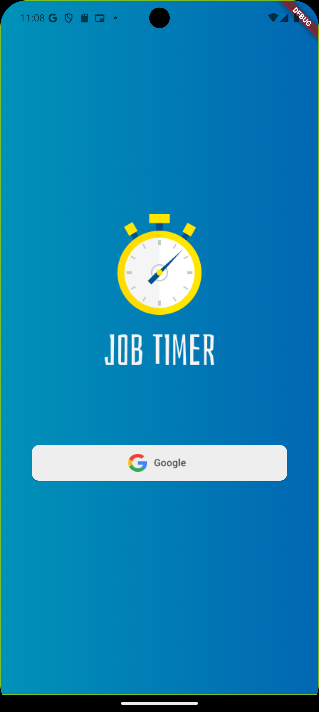

# Job Timer

Job Timer é um aplicativo de estudo desenvolvido para ajudar no controle de tempo de projetos. Ele permite que os usuários cadastrem projetos e registrem o controle de tempo através de tarefas (tasks). O projeto segue a arquitetura MVC e utiliza o `ChangeNotifier` para gerenciamento de estado, priorizando um código limpo e organizado.

---

## Funcionalidades

- **Autenticação via Google:** Login obrigatório na primeira vez que o usuário acessa o aplicativo.
- **Gerenciamento de Projetos:**
  - Lista de projetos existentes.
  - Filtragem de projetos por status (Em andamento ou Finalizados).
  - Criação de novos projetos com validação de dados.
- **Dashboard do Projeto:**
  - Visualização do tempo gasto e disponível.
  - Lista de tarefas associadas ao projeto, com nome e duração.
  - Adição de novas tarefas relacionadas ao projeto.
- **Persistência de Dados:** Uso do Firebase Database para salvar os projetos e tarefas.
- **Configurações de Conta:** Logout da conta Google.

---

## Tecnologias Utilizadas

### **Arquitetura**
- **MVC (Model-View-Controller):** Organização do código para facilitar a manutenção e evolução do projeto.
- **ChangeNotifier:** Gerenciamento de estados eficiente e reativo para atualizar as telas do aplicativo.

### **Bibliotecas**
- **`cupertino_icons`:** Ícones no estilo Cupertino para uma interface mais moderna e consistente.
- **`flutter_modular`:** Facilita a navegação e a injeção de dependências, promovendo uma separação clara entre os módulos do aplicativo.
- **`asuka`:** Utilizado para exibir mensagens contextuais (snackbars e diálogos), garantindo uma experiência de usuário melhorada.
- **`validatorless`:** Simplifica a validação de campos de formulário com validações personalizáveis.
- **`fl_chart`:** Permite criar gráficos intuitivos e atraentes para exibir informações no dashboard.
- **`firebase_core` e `firebase_auth`:** Integração com o Firebase para autenticação e serviços de backend.
- **`google_sign_in`:** Gerenciamento simplificado de autenticação via Google.
- **`equatable`:** Facilita comparações de objetos imutáveis, melhorando o gerenciamento de entidades.
- **`path_provider`:** Acesso ao sistema de arquivos para armazenar e recuperar dados localmente.
- **`cloud_firestore`:** Banco de dados em tempo real para persistência de projetos e tarefas.

---

## Organização do Código

- **Classes de Tema:** Todas as cores do aplicativo são armazenadas em uma classe centralizada para facilitar a consistência visual e manutenção.
- **Classes de Constantes:** Todas as chaves usadas em mapeamentos (mappers) são armazenadas em classes constantes, promovendo segurança e organização no acesso aos dados.

---

## Telas do Aplicativo

1. **Tela de Login:** Autenticação via conta do Google.
2. **Tela Inicial:**
   - Lista de projetos cadastrados.
   - Filtro por status (Em andamento ou Finalizados).
   - Botão para criar novos projetos.
   - Opção para logout.
3. **Tela de Criação de Projetos:**
   - Formulário para nome e estimativa de tempo.
   - Validação de campos.
4. **Tela de Detalhes do Projeto:**
   - Dashboard com tempo gasto e disponível.
   - Lista de tarefas associadas ao projeto.
   - Botão para criar novas tarefas.

---

## Como Contribuir

1. Faça um fork do projeto.
2. Crie uma nova branch: `git checkout -b minha-feature`.
3. Faça suas alterações e commit: `git commit -m 'Minha nova feature'`.
4. Envie para o seu fork: `git push origin minha-feature`.
5. Crie um Pull Request.

---

## Licença

Este projeto está licenciado sob a [MIT License](LICENSE).

---

## Contato

Desenvolvedor: Jefferson Pereira  
[LinkedIn](https://www.linkedin.com/in/jefferson-oliveira-780a191b6/) | [Email](mailto:jpo.developer@gmail.com)

