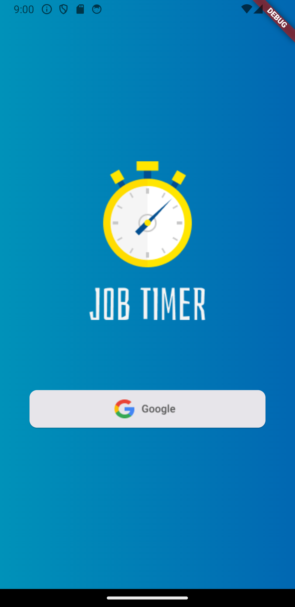

# Descrição do Pull Request: Implementação Visual da Tela de Login para Autenticação pelo Google

Neste pull request, foi desenvolvida a parte visual da tela de login, com a intenção inicial de permitir autenticação exclusivamente através do Google.

## Interface Gráfica da Tela de Login

- A estrutura visual da tela de login foi criada seguindo as diretrizes de design estabelecidas.
- Elementos visuais, como botões e campos de entrada, foram incorporados para proporcionar uma experiência amigável ao usuário.
- O objetivo principal é permitir uma navegação intuitiva e fácil para o processo de login via Google.

